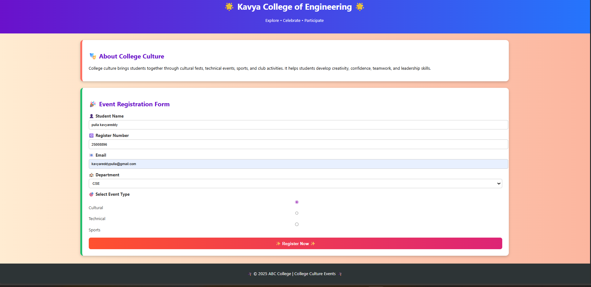

# Ex09 Event Registration Web Application
# Date:24-12-25
# AIM:
To design, develop and deploy a web application for event registration.

# DESIGN STEPS:
## Step 1:
Create a new frame.

## Step 2:
Select any one preset size of your choice.

## Step 3:
Select the shapes you need.

## Step 4:
Import images as needed.

## Step 5:
Create pages based on your need and link them.

## Step 6:
Validate the HTML and CSS code.

## Step 6:
Publish the website in the given URL.

# DESIGN TOOL:
Figma

# CODE:
figma.html
```
<!DOCTYPE html>
<html lang="en">
<head>
    <meta charset="UTF-8">
    <title>College Culture Event Registration</title>
    <link rel="stylesheet" href="style.css">
</head>
<body>

    <header>
        <h1>🌟 Kavya College of Engineering 🌟</h1>
        <p>Explore • Celebrate • Participate</p>
    </header>

    <section class="about">
        <h2>🎭 About College Culture</h2>
        <p>
            College culture brings students together through cultural fests,
            technical events, sports, and club activities. It helps students
            develop creativity, confidence, teamwork, and leadership skills.
        </p>
    </section>

    <section class="form-section">
        <h2>🎉 Event Registration Form</h2>

        <form>
            <label>👤 Student Name</label>
            <input type="text" placeholder="Enter your name" required>

            <label>🆔 Register Number</label>
            <input type="text" placeholder="Enter register number" required>

            <label>📧 Email</label>
            <input type="email" placeholder="Enter email" required>

            <label>🏫 Department</label>
            <select>
                <option>CSE</option>
                <option>ECE</option>
                <option>EEE</option>
                <option>MECH</option>
                <option>CIVIL</option>
            </select>

            <label>🎯 Select Event Type</label>
            <div class="radio">
                <input type="radio" name="event"> Cultural  
                <input type="radio" name="event"> Technical  
                <input type="radio" name="event"> Sports  
            </div>

            <button type="submit">✨ Register Now ✨</button>
        </form>
    </section>

    <footer>
        <p>🎓 © 2025 ABC College | College Culture Events 🎓</p>
    </footer>

</body>
</html>

```
style.css
```
body {
    margin: 0;
    font-family: "Segoe UI", sans-serif;
    background: linear-gradient(to right, #ffecd2, #fcb69f);
}

/* Header */
header {
    background: linear-gradient(to right, #6a11cb, #2575fc);
    color: white;
    text-align: center;
    padding: 25px;
}

/* Sections */
.about, .form-section {
    background-color: white;
    margin: 25px auto;
    padding: 25px;
    width: 70%;
    border-radius: 12px;
    box-shadow: 0 4px 10px rgba(0,0,0,0.2);
}

.about {
    border-left: 8px solid #ff6f61;
}

.form-section {
    border-left: 8px solid #20bf6b;
}

h2 {
    color: #6a11cb;
}

/* Form */
label {
    display: block;
    margin-top: 12px;
    font-weight: bold;
    color: #333;
}

input, select {
    width: 100%;
    padding: 10px;
    margin-top: 6px;
    border-radius: 6px;
    border: 1px solid #ccc;
}

.radio {
    margin-top: 8px;
    color: #444;
}

button {
    margin-top: 20px;
    width: 100%;
    padding: 12px;
    font-size: 16px;
    font-weight: bold;
    color: white;
    border: none;
    border-radius: 8px;
    cursor: pointer;
    background: linear-gradient(to right, #ff512f, #dd2476);
}

button:hover {
    opacity: 0.9;
}

/* Footer */
footer {
    background: #2d3436;
    color: white;
    text-align: center;
    padding: 12px;
    margin-top: 30px;
}

```
# OUTPUT:

# RESULT:
The program to design, develop and deploy a web application for event registration is completed successfully.
